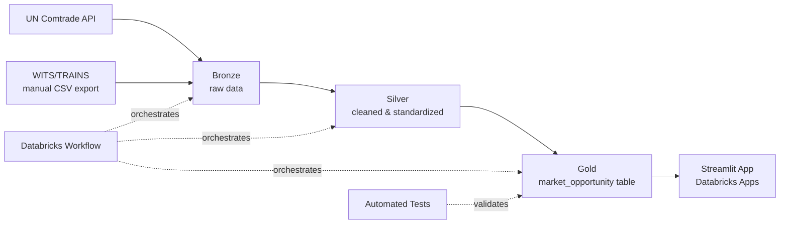

# AfCFTA Trade Intelligence

A Databricks data pipeline and lookup tool that shows, for a given product and country, how favorably that product is treated under African trade rules and how much of that product actually gets traded.

**In plain terms:** pick a product (like coffee, cotton, or fruit) and a country (Kenya, Nigeria, Egypt, South Africa, or Ghana), and see whether that country's real, applied import tariff on that product is *higher or lower* than the standard rate everyone else pays plus how much of that product the country actually trades.

---

## 1. The problem, and why GIZ cares about it

In 2026, the German development agency GIZ published an Expression of Interest / Request for Information titled **"Digital Technologies for International Trade,"** as part of its support to the **African Continental Free Trade Area (AfCFTA)** the largest free trade area in the world by number of countries, covering 54 African Union member states.

The document laid out a real, documented problem: African trade is still weighed down by manual processes, scattered data, and a lack of accessible tools that tell traders and small businesses what tariff treatment they actually qualify for. GIZ organized this into seven thematic areas trade compliance, paperless trade, trade finance, supply chain visibility, **market intelligence and trade analytics**, customs digitization, and integrated solutions and asked the market what already exists that could help.

This project responds to **Area 5: Market Intelligence and Trade Analytics.** The specific gap GIZ described: a small business or trade analyst can't easily answer "does my product qualify for a better tariff rate under AfCFTA, and how does that compare to the standard rate?" without hiring a specialist to dig through tariff schedules by hand.

**Important honesty note:** this project is inspired by and built in response to that GIZ document, but it is an independent portfolio project not an official submission to GIZ's procurement process. It exists to demonstrate the kind of pipeline and tool GIZ described, built from real public data.

---

## 2. What we actually built

A data pipeline that:
1. Pulls real trade and tariff data for 5 African countries from two international data providers
2. Cleans and standardizes it
3. Joins it into one table that compares each country's real ("applied") tariff rate against the standard ("MFN") rate everyone pays
4. Serves that comparison through a simple web app anyone can use no coding required

### For the non-technical reader
Think of it like this: imagine a spreadsheet where, for every country and product we cover, you can see two prices "what this country normally charges everyone" and "what this country actually charges in practice" (which is sometimes lower, because of trade agreements like AfCFTA). Our tool builds that spreadsheet automatically from real government-reported data, and lets you browse it through a simple app instead of digging through raw files yourself.

---

## 3. Scope (Milestone 1)

- **Countries:** Kenya, Nigeria, Egypt, South Africa, Ghana
- **Products (HS chapters):** 08 (edible fruit & nuts), 09 (coffee, tea, mate & spices), 52 (cotton)
- **Years:** 2023-2024 for trade volume; 2023 for tariffs (see limitations below)

---

## 4. Architecture



- **Bronze:** raw data landed as-is, exactly as received from each source, with an ingestion timestamp
- **Silver:** standardized country codes and product codes, cleaned column names, explicit null handling
- **Gold:** a single table (`afcfta_trade.gold.market_opportunity`) joining trade volume with applied vs. MFN tariff rates, ready for the app to query directly
- **Orchestration:** a Databricks Workflow runs bronze → silver → gold → automated tests in sequence, on a weekly schedule, with email alerts on failure
- **Serving:** a Databricks App (Streamlit) that lets anyone browse the results without touching code or SQL

- **Bronze:** raw data landed as-is, exactly as received from each source, with an ingestion timestamp
- **Silver:** standardized country codes and product codes, cleaned column names, explicit null handling
- **Gold:** a single table (`afcfta_trade.gold.market_opportunity`) joining trade volume with applied vs. MFN tariff rates, ready for the app to query directly
- **Orchestration:** a Databricks Workflow runs all 4 stages (bronze -> silver -> gold -> automated tests) in sequence, on a weekly schedule, with email alerts on failure
- **Serving:** a Databricks App (Streamlit) that lets anyone browse the results without touching code or SQL

---

## 5. Platform and tools used

| Layer | Tool |
|---|---|
| Data warehouse / lakehouse | **Databricks** (Unity Catalog: `afcfta_trade` catalog, with `bronze`/`silver`/`gold` schemas) |
| Processing | **PySpark**, running inside Databricks notebooks |
| Storage format | **Delta Lake** |
| Orchestration & scheduling | **Databricks Workflows** |
| App / interface | **Databricks Apps** running **Streamlit** |
| Version control | **GitHub**, synced to Databricks via **Databricks Repos** |
| Local scripting / data pull | **Python** (`requests`, `pandas`, `pyyaml`) |

---

## 6. Data sources

- **[UN Comtrade](https://comtradedeveloper.un.org/)** -- bilateral trade flow statistics (how much of each product each country imports/exports). Free API, no cost.
- **[WITS/TRAINS](https://wits.worldbank.org/)** (World Bank / UNCTAD) -- tariff data: both the "applied" rate (what's actually charged, including any preferential/AfCFTA discount) and the "MFN" rate (the standard rate). Free, web-based query tool.

---

## 7. Known data limitations (and why they're there, not hidden)

Real-world data has gaps. Rather than hide them, here's exactly what's missing and why:

- **Egypt has no country-level tariff data available.** Confirmed directly through WITS's own query tool -- it returned "No data available for selected reporters." Egypt only appears in the tariff database as part of aggregate regional groupings, not as an individual country. Egypt's *trade volume* data is still included; only its tariff comparison is missing.
- **Tariff data is 2023-only; trade volume data covers 2023 and 2024.** National governments submit their tariff schedules to international databases with a lag -- 2024 submissions weren't yet available at the time of this build. The gold table flags every row where the trade year and tariff year don't match (`tariff_data_year_mismatch`), so this is visible rather than silently assumed.
- **Tariff data required a manual export, not an API call.** The standard Python library for querying WITS returned errors for every country tested -- including major economies like the USA -- indicating the library itself is broken or outdated, not that the data doesn't exist. We used WITS's own web-based query tool to export the data directly instead. This is documented here rather than hidden because it's a legitimate, common real-world workaround when a public data provider's tooling is unreliable.
- **Only "World" aggregate partner data was used for tariffs, not country-to-country pairs.** This means the tool shows "how favorably does Kenya treat coffee imports overall," not "specifically what tariff would Kenya charge on coffee from Nigeria." Bilateral (country-to-country) preferential rates under AfCFTA specifically were not reliably available in the free data sources used here -- a natural next milestone.
- **Kenya's cotton tariff is an interesting real finding, not an error:** the applied rate (22.85%) is actually *higher* than the standard MFN rate (19.15%) for this product. This is a genuine data finding -- not every product benefits from a lower preferential rate in every country, and the tool is built to surface exactly this kind of honest result rather than assume preferential treatment always means "cheaper."

---

## 8. How to see it / interact with it

**If you just want to see the results -- no technical setup needed:**
Open the deployed Databricks App link (shared separately) -- pick a product from the dropdown, and it shows the tariff comparison and trade volume for all 5 countries.

**If you want to explore or verify the pipeline itself:**
1. The full pipeline runs automatically every week in Databricks, and you can review each run's results under Workflows -> `afcfta_milestone1_pipeline`
2. All code is in this GitHub repository, organized as:
   - `notebooks/01_bronze_ingestion.py` -- pulls raw data
   - `notebooks/02_silver_transform.py` -- cleans it
   - `notebooks/03_gold_mart.py` -- builds the final comparison table
   - `notebooks/04_tests.py` -- automated data quality checks (10 checks, all passing)
   - `src/` -- the original local scripts used to pull and sanity-check the raw data before moving into Databricks
   - `config.yaml` -- the exact countries, products, and years this project covers

**To run it yourself:**
```bash
pip install -r requirements.txt
python3 src/ingest_comtrade.py   # requires a free UN Comtrade API key
python3 src/ingest_wits.py       # requires manually exported WITS CSVs -- see notebooks for details
```
Then upload the outputs to a Databricks Unity Catalog Volume and run the 4 notebooks in order (or trigger the Databricks Workflow, which does this automatically).

---

## 9. Status

- [x] Bronze, silver, gold pipeline -- built and tested
- [x] Automated data quality tests -- 10/10 passing
- [x] Databricks Workflow orchestration -- scheduled weekly, with email alerts
- [x] Git integration (Databricks Repos <-> GitHub)
- [x] Serving layer -- Databricks App (Streamlit)
- [ ] NLP-based non-tariff-barrier tagging (in progress)
- [ ] Bilateral (country-to-country) preferential tariff data (future milestone)

---

## 10. License

MIT -- see `LICENSE`.